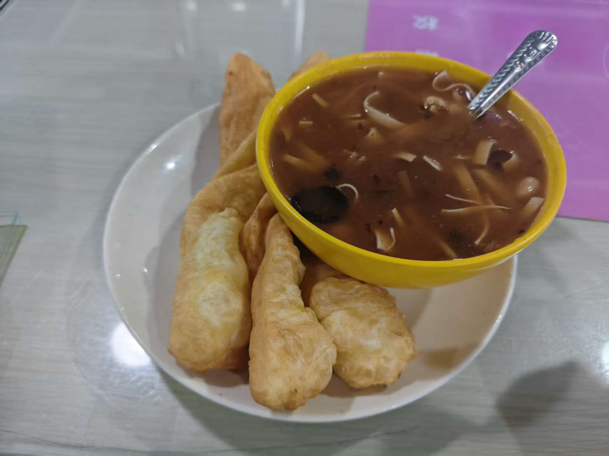

人生第一次打正式的线下ACM赛制的比赛。

## 流水账

3/20，临近12点，我挺焦虑的。 
近期其实练得不多，明天要是连那些刚入坑的都没打赢是不是可以考虑退役了？ 
 

“去不去网吧” 
有个妹子打瓦缺固排，于是—— 
在3/21 8：00，我带着萎靡的精神状态回到了zzu，吃了个早餐（偶遇了足球校队队友，好尴尬），还补了那么一会会觉。 

 

在院办门口和队友碰面后，我们蠕进了机房，出人意料的是一眼扫过去能看到不少妹子，大概有3队的量。 
<del>原来也不是所有打a的都是方框眼镜寸头</del>。 
灌了半瓶红牛后，我迎来了人生第一场ACM比赛。 

 

## 赛时

队友都是同级的萌新，三个人招新赛的排名差不多。 
我们商定的策略是“分治”，一共14题，每人读4题，M和N最后再看。 

题A是个很简单的期望题，有n个饺子m个馅，输出猜n次后的期望，但是这是我第一次做这种只用输出答案的题目，我不是很有把握，和队友讲了思路之后决定来一发——WA. 
题B是DFS，我个人认为不是很有性价比，以我们队目前的实力很难在短时间内调出来。 

szh突然和我说他题e有思路，我听了听是那么回事，陪他敲了一下——WA。 

我们注意到很多队都把M题过了，一看，纯粹的签到题，收菜！——AC！ 
题C非常简单，很基本的模拟，我像看到前女友一般扑到机子上，先拿一题再说，——AC！ 
题D看不懂。 

到此，我们的头两个小时过完了，交换了一下进度。 
接下来的环节——我去读N，szh对H有想法，yyx觉得I能写。 
我对N很有想法，经过了一通模拟+总结规律后我端出了一个n²的算法，——RE！ 

与此同时，szh把H调出来了，我听了思路，没什么问题——AC！ 

yyx和szh开始磕E，我过去观战——他俩找出了这题的逻辑——找出一个非质数因数就赢了，所以找两个质因数出来也行（俩质数合起来就是合数嘛）。 
然而我们开始犯糖了——yyx和szh调不明白复杂度，我端着书过去救场——我没get到他们的思路，模板是对的但是我忘了“重复的质因数”这个情况。 
然后我们三个人开始轮流试，在WA,TLE之间循环。 
时间不断流逝，还剩1h不到的时间我们居然只出了三题，名为波士顿的幽灵正在中核教学楼盘旋... 

——我悟了！我直接找非质数因数不就行了吗，好歹我能搓出来合理的代码——来一发吧！ 
——AAAAAAAAAAAAAAAAAAAAAAAAAAC!!!!GOOOOOOOOOOOOOOOOOOOOOOOOOOOOOOAL! 

我抬头看气球（挺有意思的，我才知道出了一题就会有一个对应的气球在自己的机子前），题A挺多人过的。 
冷静下来思考后发现——直接就是1+(n-m)*(1/m)，——AC！ 

决胜时间，摆在我们面前的是：
N题能过样例，但是一直re。 
I和J都是很简单，也敲出来了基本的代码，但是就是过不了。 
我去N，I和J交给szh和yyx。 

但是我们还是没做到。我不太知道I和J什么情况，我只感觉我离做出N不是很远。 

最后滚榜的时候还是有点期待自己能混个三等奖的，结果还是没做到，三等奖最后一名也是五题，我们差了罚时。 
不过我们封榜时间出了俩题，小小的在滚榜时间装了一下，冲刺了几十名。挺开心的 

## 一些想法。

怎么说呢，赛前想的“再怎么样不能打不过那些刚入坑的”底线还是守住了，隔壁宿舍几个刚入坑的4题（笑） 

细细想来，我们队的问题有很多：（1）太菜了基本的模板都不熟练，熟一点的话E直接秒了多至少一个小时给I和J，7题二等奖都有戏。 
（2）不会造数据，导致我们基本上是在用wa和RE来测代码。 
（3）沟通还是不够高效，比如I和J其实更值得冲，但是我们最后才交换了这一点。 

但是，我们的决定是——我们要继续下去！ 
其他两个人的理由我不太清楚，我的话——我在打比赛的时候找回了久违的悸动。连出E和A的时候我感觉我像molodoy. 

之后的强度是：每个人每周打一把比赛&补题 / 练算法题，刚开始我也不太好push。 